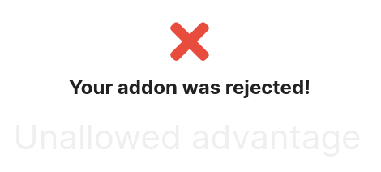

# ItemsOnGroundMC
- highlights items on the ground in Minecraft
- highlights spawner (to find dungeons)

## Plugin State
This Plugins was rejected by Labymod. So it is not installable from the Labymod-Store.

Reason: "Unallowed advantage"

Installation instructions [here](#Installation).

## Screenshots
### Items on the ground

### Spawner

## Installation
1. Download a release
1. Save the jar under your minecraft-folder/LabyMod/addons-1.12/
1. Check out the config ingame.